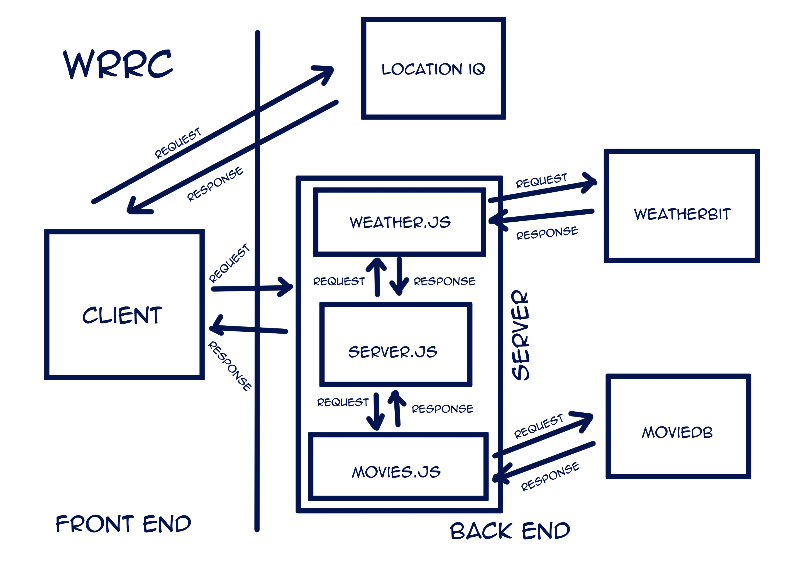
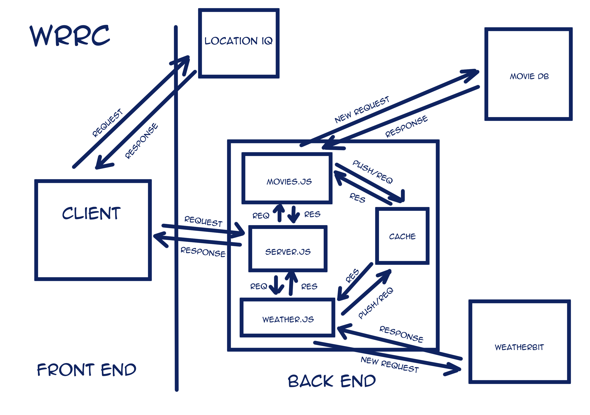

# City Explorer API

**Author**: Dana Huffman
**Version**: 1.3.0

## Overview

Takes information from city-explorer and returns data from an API

## Getting Started

- Run `npm install`

## Architecture

Created using Node and JavaScript

## Change Log

05-17-2022 6:49pm - Got Weather API running
05-17-2022 7:30pm - Added error handling
05-18-2022 4:46pm - Updated /weather to pull from API
05-18-2022 5:50pm - Added API call and object for movies
05-19-2022 4:30pm - Completed modularization
05-20-2022 3:41pm - Fixed all bugs in starter code for caching

## Credit and Collaborations

[in class demo](https://github.com/codefellows/seattle-code-301d85/tree/main/class-07/in-class-demo/pets-api-301d85)

 Made with [Denis Rendon](https://github.com/DenisRendon) and [Cheri Hodge](https://github.com/cheriezus)

 Made with [Elizabeth Hammes](https://github.com/ehammes)

[in class demo](https://github.com/codefellows/seattle-code-301d85/tree/main/class-08/in-class-demo/image-finder-back-end-301d85)

 Made with [Vinny Shipley](https://github.com/VinnyShipley)

[in class demo](https://github.com/codefellows/seattle-code-301d85/tree/main/class-09/in-class-demo/image-finder-back-end-301d85)

 Made with [Katharine Swilley](https://github.com/kath-a-rine)

[in class demo](https://github.com/codefellows/seattle-code-301d85/tree/main/class-10/in-class-demo/image-finder-back-end-301d85)

## Time Estimates

Name of feature: **#1 Weather**

Estimate of time needed to complete: 1 hour

Start time: 5:09

Finish time: 6:47

Actual time needed to complete: 1 hour(approx. I took a dinner break)

Name of feature: **#2 Errors**

Estimate of time needed to complete: 10 minutes

Start time: 7:23

Finish time: 7:30

Actual time needed to complete: 7 minutes

Name of feature: **#3 Weather(live)**

Estimate of time needed to complete: 30 min

Start time: 4:25

Finish time: 4:45

Actual time needed to complete: 20 min

Name of feature: **#4 Movies**

Estimate of time needed to complete: 45 min

Start time: 5:00

Finish time: 5:49

Actual time needed to complete: 49 min

Name of feature: **#5 Modularization**

Estimate of time needed to complete: 45 min

Start time: 3:35

Finish time: 4:27

Actual time needed to complete: 52 min

Name of feature: **#6 Caching**

Estimate of time needed to complete: 60 min

Start time: 3:19

Finish time:

Actual time needed to complete:
